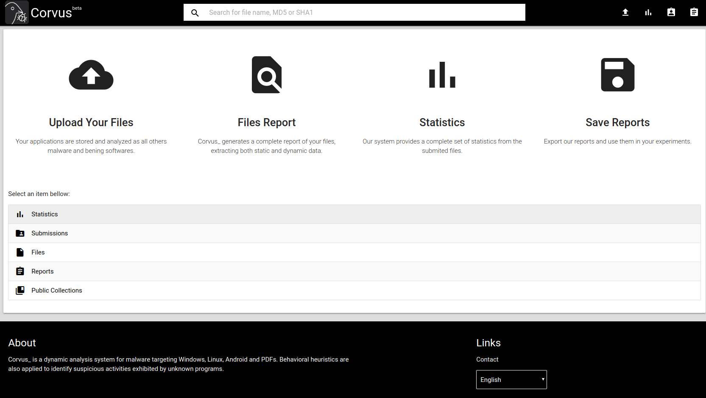

# BehEMOT-NG

## What is This?

* BehEMOT-NG is the next generation of our malware sandbox. BehEMOT stands for *Behavioral Evaluation of Malicious Objects Tool*.

## Development Team

* BehEMOT is developed by Marcus Botacin under supervision of Dr/PhD André Grégio.

## Source Code

* We are facing some dificulties to open-source BehEMOT code due to limited resources. Get in touch if you want to join this project.

## Availability

* Currently, BehEMOT can be used online via the [Corvus Project](https://corvus.inf.ufpr.br/)

